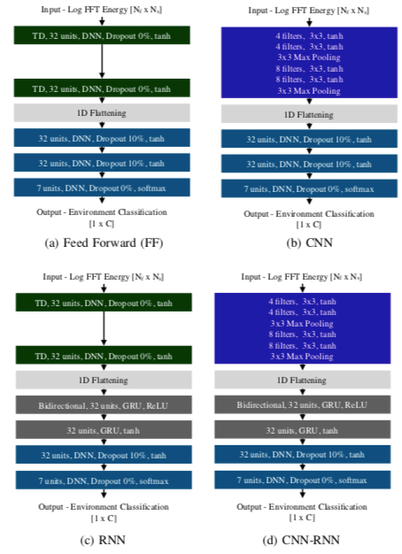
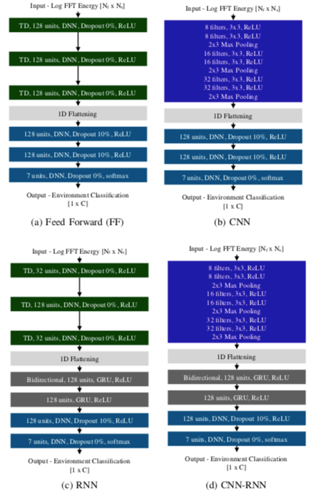
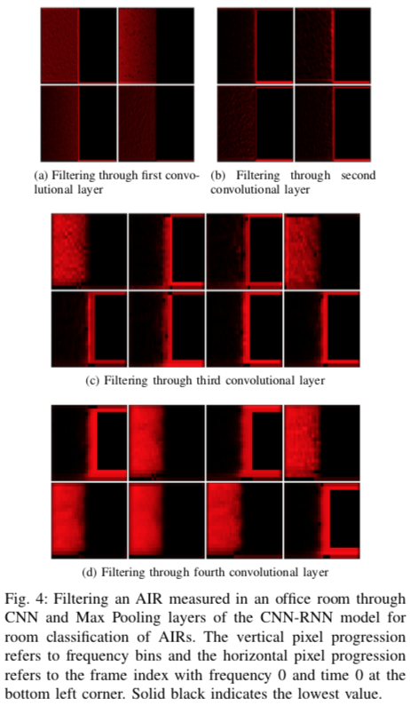
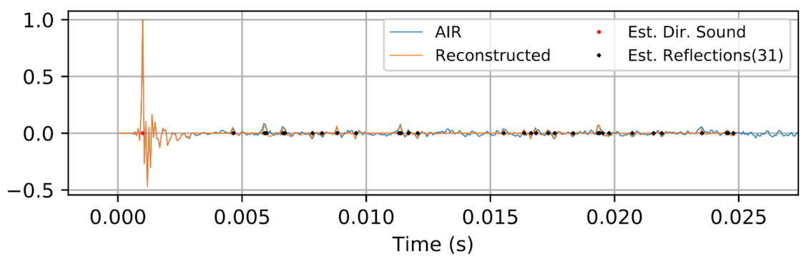
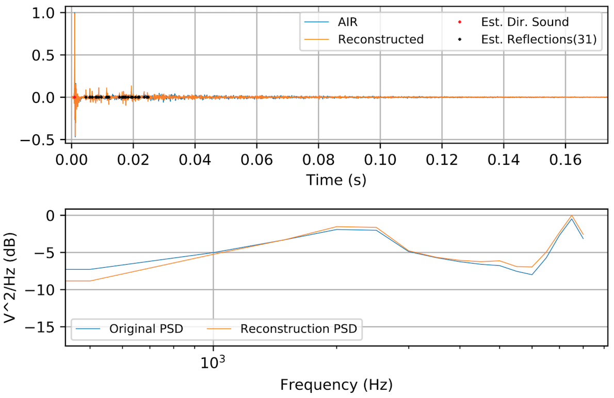
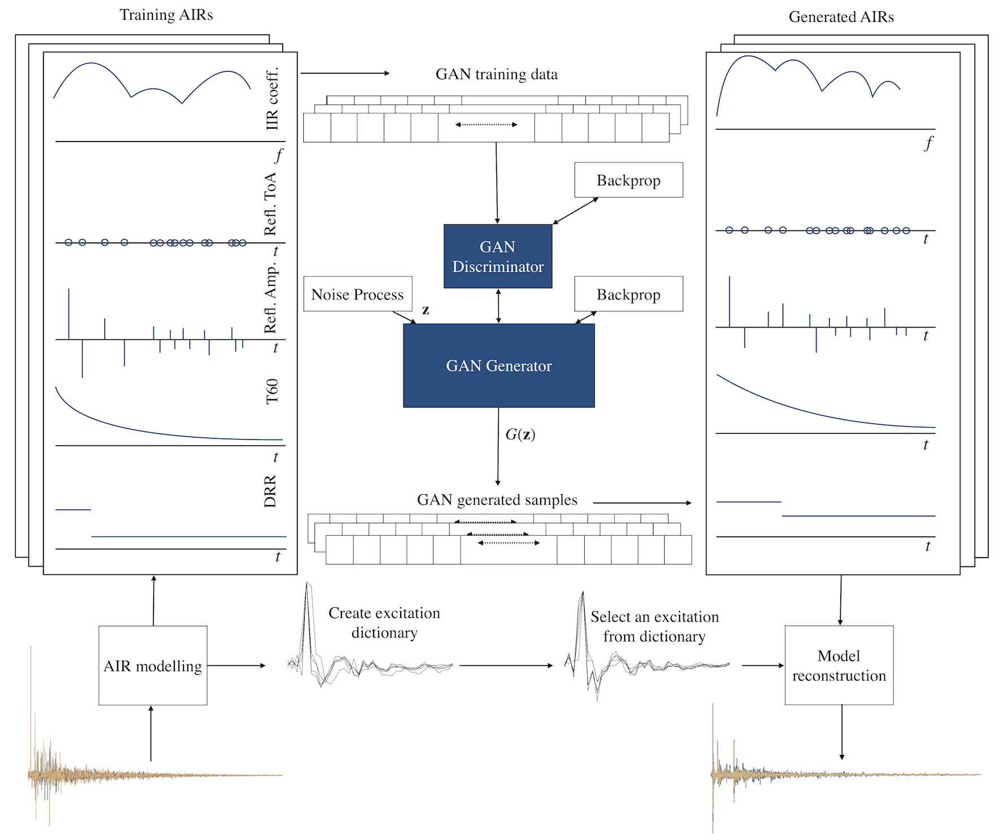
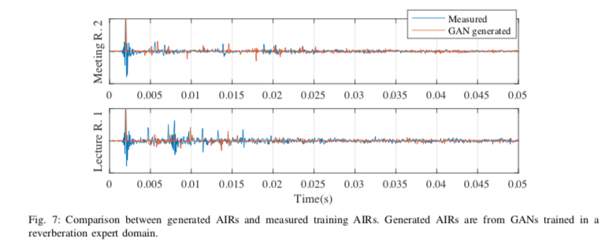

# Reverberation Learning Toolbox for Python

_Copyright 2018 [Constantinos Papayiannis](https://www.linkedin.com/in/papayiannis/)_  
_Reverberation Learning Toolbox for Python is free software: you can redistribute it and/or modify it under the terms of the GNU General Public License as published by the Free Software Foundation, either version 3 of the License, or (at your option) any later version._

# Introduction

Training DNNs has been a tone in the modelling of complex relationships between the observed world and its high level properties, which we use to describe it. Their contribution to the field of image-object recognition, speech recognition and language processing has pushed the boundaries of state-of-the-art in the field. Their potential benefits have not been thoroughly discussed in the literature in terms of the modelling and classification of the reverberation effect however, which can lead to an improvement over current methods. Some contributions have looked at dereverberation using DNNs. The motivation to _understand_ the effect however has not been substantially explored in the context of DNNs in the literature. 

The work in [1] has been one of the first steps in using deep learning to understand the underlying model of the reverberation effect. The subsequent work in [2] has also illustrated how a compact and semantically meaningful model for the effect can lead to estimates of the generative models for the underlying process. Connecting the classification and generative model estimation tasks, [2] shows how data-augmentation leads to more accurate classification of the reverberation effect. The generative models, estimated using GANs, find applications beyond classification and allow for the generation of reverberant acoustic environments. The training of the generator network aims to create environments indistinguishable from real ones, when judged by a DNN adversary to the process. 

This repository includes the code that was used to classify reverberant acoustic environments in terms of rooms.  for reverberation can all of It also contains useful code for DSP, speech processing and deep learning using Keras.

_Note: the code provided here is for the purpose of allowing researchers to use the techniques proposed in the referenced work in their own research. To reproducing the experiments of the work in terms of getting the same results you should adjust the values of the relevant algorithms in the code and acquire the same data from the same sources. Hardware specifications and Python (+packages) versions also affect the results. Any work using this code is expected to provide appropriate citations to the papers at the bottom of this page_

# Description

This repository offers a toolbox which allows the user to

1. DNN training for reverberant acoustic environments
	* Prepare reverberant environment training data for DNN classifiers
	  * Can create directly data from AIRs.
	  * Can create reverberant speech data, combining the AIRs and anechoic speech.
	  * Flexibility over classification tasks considered. 
	    * Can provide labels for rooms, position, room type and microphone arrays.
	* Train DNNs for room classification with configurable architectures. Supports:
	  * FF Networks
	  * CNNs
	  * RNNs
	  * Bidirectional RNNs
	  * CNN-RNNs
	* Provides dedicated routines for collecting data from the ACE challenge corpus [3].
* Methods for modelling of acoustic environments
	* Routines for the modelling of acoustic environments using a given AIR, using the method of [2].
* GAN generative model estimation for the reverberation effect.
	* Using the method of [2], GANs are trained for reverberant environments
	* Data augmentation strategies for deep learning using reverberation data
* Reusable and useful routines for
	* Keras model learning
		* Model training routines
		* Batch generation
		* Batch balancing
		* Multi-purpose and customisable callbacks 
		* CNN filter and feature map visualisation for audio
		* Confusion plots
	* Signal processing and signal manipulation.
	* Reverberation and acoustic parameter estimation.
  
# Setup

To use the repository start by setting up your environment. I assume you have anaconda and you are working with Python2.7. The code has not been checked with Python3.

```bash
# Get the repository
git clone https://github.com/papayiannis/reverberation_learning_python
cd reverberation_learning_python
# Get dependencies
conda install numpy keras scipy tabulate matplotlib pandas seaborn h5py scikit-learn
# Unpack the AIR data
cd Code/Local_Databases/AIR
tar zxf ACE16.tar.gz 
```

# Room classification

The work in [1] discussed methods and strategies for training DNNs for room classification of reverberant acoustic environments. 

## AIRs

The first set of experiments looked at how AIRs can be used to train DNNs and how they can be used for inference. The 4 candidate architectures for the task, confided in the paper are shown below.



To train all these networks in sequence, do the following  

```bash
# Unpack the AIR data
cd Code/Local_Databases/AIR
tar zxf ACE16.tar.gz 
cd ../../pythonsrc
# Run the training example for a CNN-RNN room classifier using ACE AIRs
bash run_ace_discriminative_nets.sh ../Local_Databases/AIR/ACE16 \
  /tmp/ ../results_dir/ace_h5_info.h5 0 4 |\
  tee thelog.txt
# Make confusion plots
python ace_confusions.py --preds 
		<(tac thelog.txt |\
		  grep -m 1 -B 1000000 'AIR  ' | \
		  tac  | tail -n +3  | head -n -1 \
		  | sed 's/[[:space:]]\{1,\}/,/g' \
		  | cut -d, -f1,2 )  
# Visualize the learned filters
python vizualize_filters.py --evalmodel $model_h5_location --layer 5 --rows 2 --air white ../Local_Databases/AIR/ACE16/*/*/*/*.wav
```
The index 4 refers to the CNN-RNN model. ```$model_h5_location``` is the location where the Keras model was saved. This will be reported at the end of training.

## Speech

To perform the following task from reverberant speech, the corresponding 4  architectures for the task are



To train all these networks in sequence, do the following  

```bash
# Unpack the AIR data
cd Code/Local_Databases/AIR
tar zxf ACE16.tar.gz 
cd ../../pythonsrc
mkdir -p /tmp/train_test_speech
ln -s $TRAIN_SPEECH_LOC /tmp/train_test_speech/TRAIN
ln -s $TEST_SPEECH_LOC /tmp/train_test_speech/TEST
# Run the training example for a CNN-RNN room classifier using ACE AIRs and your speech files
bash run_ace_discriminative_nets.sh ../Local_Databases/AIR/ACE16 \
  /tmp/train_test_speech/ ../results_dir/ace_h5_info.h5 0 8 |\
  tee thelog.txt
# Make confusion plots
python ace_confusions.py --preds 
		<(tac thelog.txt |\
		  grep -m 1 -B 1000000 'AIR  ' | \
		  tac  | tail -n +3  | head -n -1 \
		  | sed 's/[[:space:]]\{1,\}/,/g' \
		  | cut -d, -f1,2 ) 
# Visualize the learned filters
python vizualize_filters.py --evalmodel $model_h5_location \
		--layer 5 --rows 2 --air white ../Local_Databases/AIR/ACE16/*/*/*/*.wav
		--speech $speech_file_loc
```  

The indices 1, 2, 3 and 4 again refer respectively to the FF, CNN, RNN and CNN-RNN models. The locations ```$TRAIN_SPEECH_LOC``` and ```$TEST_SPEECH_LOC``` contain respectively locations where speech wav files are included, for training and for testing of the trained DNNs. The experiments have used TIMIT, however this is not free, so I cannot provide it here. You can use any other speech data you want. ```$model_h5_location``` is the location where the Keras model was saved. This will be reported at the end of training. ```$speech_file_loc``` is the location of a speech wav file, which is convolved with the AIRs to show the learned feature map extractors.

## Filter Visualisation

As shown in the snippets in the previous Section, the repository offers routines which enable the visualisation of the filter kernels which form CNN layers. The routines also allow the user to filter audio inputs through the layers of the CNN layers and visualise the derived feature maps. Doing this for a speech segment and using a CNN-RNN for room classification, the derived feature maps are the following [1].



To learn more about how to perform the visualization, then use ```python vizualize_filters.py --help```.

# Channel Modelling

Acoustic environments are typically described by the AIR between the source and the receiver. The AIRs however involve thousands of taps and the taps are not semantically meaningful. The work in [2] has proposed a model for describing the acoustic channel, which is based on a sparse parametric description for the early part of the AIR and a stochastic model for the decaying tail. This repository provides the code which estimates the model's parameters and returns their values, along with the reconstruction of the AIR.

Running the modelling process for an AIR part of a meeting room is shown below. The first graph shows the modelling of the early part. It is acquired using  

```bash  
# Early part modeling
python acenvgenmodel_worker.py --nomatlabinit   \  
  		--fs 16000  --transition 0.024  --sparsefact 0.8 \  
  	 	--lassocoef 0.8  --nodisplay --early
```



Modelling the entire AIR is shown below and it is done using   

```bash  
python acenvgenmodel_worker.py --nomatlabinit \
		--fs 16000  --transition 0.024  \  
		--sparsefact 0.8 --lassocoef 0.8  \  
		--nodisplay --early
```



The modelling process returns the list of estimated model parameters values:

```
AR coeff:  1.000000000000000, -0.44454541345224, -0.02695678059391, 0.157283308494094, -0.07222673151726, 0.051910899876129
MA coeff:  0.059760561986742, -0.04452413473089, 0.041496299303736, -0.02467812879859, -0.00713476568347, -0.00529095557432
Excitation :  -0.02331282941218, 0.040945683081958, -0.06157187185551, 0.167923474658362, 1.000000000000000, -0.26269206463295, 0.095733843886300, -0.46003065269976, 0.052286180658377, -0.29709754191830, 0.159375822239417, -0.03161582651734, 0.096333896625470, -0.04980428988977, -0.05116383141256, -0.12948265768155, -0.01867973349046, 0.047091887401738, 0.025270848434884, 0.028795139783907, -0.10615282426281, -0.07001180221289, -0.04510675825859, -0.00306217072971, -0.00184522575705, 0.001494871739269, -0.06191847914712, -0.05673631622947, -0.04611743414192, -0.01654094968921, -0.00656052881383, -0.00081431909278, -0.03522766915245, -0.02525191973522, -0.04177005905556, -0.01266520378901

Direct Sound
            ToA      SOA    Amplitude
--  -----------  -------  -----------
 0  0.000999744  15.9959      1.00496
Reflections
           ToA       SOA     TOA (r)    Amplitude  
--  ----------  --------  ----------  -----------  
 0  0.00465407   74.4652  0.00365433    0.0511781  
 1  0.00590499   94.4798  0.00490524    0.0739179  
 2  0.00597806   95.649   0.00497832    0.0575524  
 3  0.00665114  106.418   0.0056514     0.0585191  
.
.
.
29  0.0245845   393.352   0.0235848     0.0328085  
30  0.0247861   396.578   0.0237864    -0.0159576
```

To run the modelling on the entire ACE database AIR set, the following script can be used

```bash
# Run acoustic environment modelling on all ACE data
bash ace_acenvgenmodeling.sh /tmp/modeling_results
```

# GAN Training and data augmentation

Training GANs provides estimates of generative models  using deep learning. The work in [2] has shown how a low-dimensional encoding of reverberant acoustic environments allows for GANs to estimate such models for the reverberation effect. The framework which was proposed has put together the sparse modelling for refections and the stochastic model for the tail to form a vector characteristic of the environment. The distribution of the elements of the vectors are learned, which allows for instances of artificial environments to be generated. The GAN is trained so that the learned instances are considered realistic, when compared to the measured ones provided to the networks during training. The process of putting together the GAN components and the modelling of environments is shown in the figure below.



To perform the training of GANs using ACE data, the following command is used

```bash
# GAN training and artificial data generation
bash gan_model_worker.sh /tmp/modeling_res  /tmp/gan_results/
```

where ```/tmp/modeling_res```, the location where the results of ```ace_acenvgenmodeling.sh``` were saved. The script trains one GAN for each room in the dataset and subsequently generates a set of responses, as if they were measured in the corresponding rooms. An example of such responses is given below



The set of generated responses finds an application in data augmentation training for DNN classifiers. To add the generated data as a data augmentation set to the CNN-RNN classifier discussed in previous Sections, following command is used:

```bash
# Train CNN-RNN room classifier with GAN data augmentation
bash run_cnnrnn_net.sh ../Local_Databases/AIR/ACE16   /tmp/ ../results_dir/ace_h5_info.h5 0 \  
--bsh5 /tmp/gan_results//gan_aug_data.h5
```
where ```/tmp/gan_results//gan_aug_data.h5``` the file generated by the above snippet, specifically command ```gan_model_worker.sh```.

# Abbreviations

AIR: Acoustic Impulse Response  
DNN: Deep Neural Network  
CNN: Convolutional Neural Network  
RNN: Recurrent Neural Network  
GAN: Generative Adversarial Network
FF: Feed Forward

# Bibliography  

[1]: [C. Papayiannis, C. Evers, and P. A. Naylor, "End-to-End Classification of Reverberant Rooms using DNNs," arXiv preprint arXiv:1812.09324, 2018.](https://arxiv.org/abs/1812.09324)  
[2]: [C. Papayiannis, C. Evers, and P. A. Naylor, "Data Augmentation of Room Classifiers using Generative Adversarial Networks," arXiv preprint arXiv:1901.03257, 2018.](https://arxiv.org/abs/1901.03257)  
[3]: J. Eaton; N. D. Gaubitch; A. H. Moore; P. A. Naylor, "Estimation of room acoustic parameters: The ACE Challenge," in IEEE/ACM Transactions on Audio, Speech, and Language Processing, vol. 24, no.10, pp.1681-1693, Oct. 2016.


